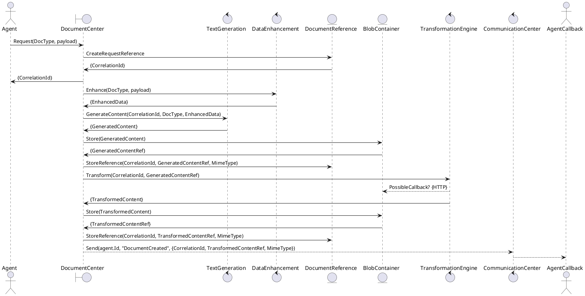
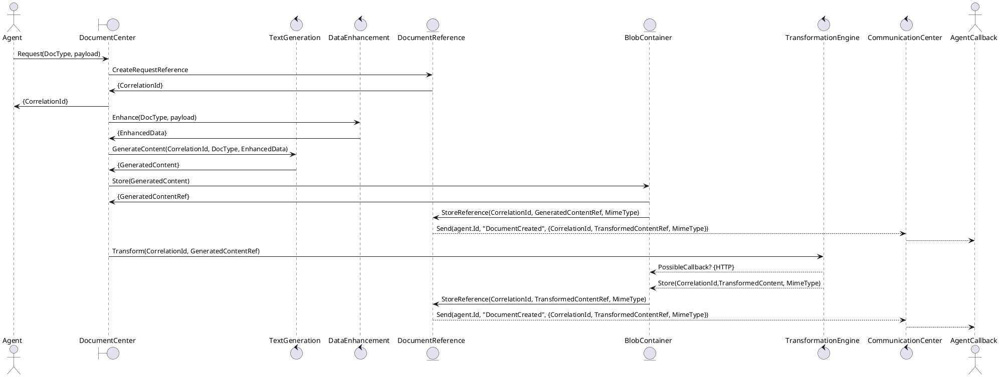

# Document Center - Document Generation Design

## Summary

The intention of document generation would be to abstractly convert document from simple text/markup to formatted rendered documents (HTML to PDF).  

Document content would be created could be created with the existing template/data enhancement processes then sent into a pipeline process to convert that content into the designed output format.

## Related Documents

* [Document Conversion](DocumentConversion.md)
* [Document Storage](DocumentStorage.md)
* [Communication Center](..\OoBDev.Communications.Abstractions\readme.md)

## Proposed Designs

### Option 1 

### Option 2

