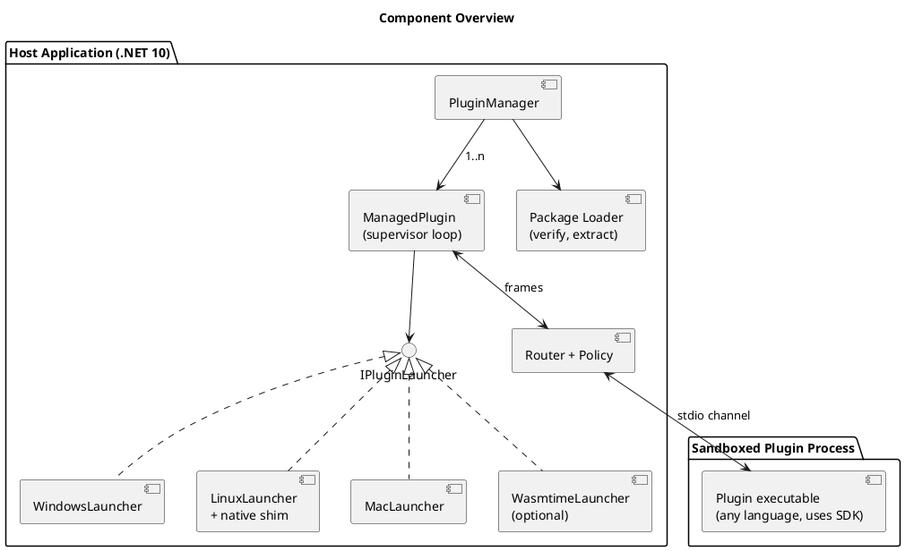
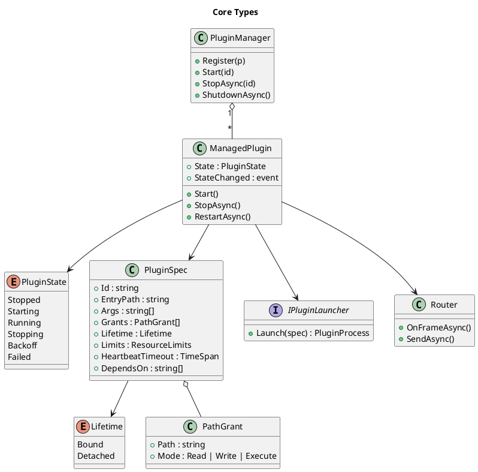

# Goals and Architecture

> Part of the plugin sandbox design (§1, §2). Index and review status: [../design.md](../design.md). Diagrams: [../diagrams/](../diagrams/).

## 1. Goals and Non-Goals

**Goals**
- Run third-party plugins, written in any language, under host-defined rules: no network, and only host-selected files.
- Pay a one-time startup cost only, with no per-call sandbox overhead.
- Give the host full lifecycle control: start, stop, restart, crash and hang recovery.
- Support two lifetime policies: **Bound** (dies with the host) and **Detached** (survives a host crash).
- Support Windows, Linux, and macOS with one protocol, one manifest, and one policy model.
- Plugins talk only to the host. Plugin-to-plugin traffic is always routed by the host.
- *(Proposed)* Let a plugin **declare** the external files and network endpoints it needs, and let the host **approve** them separately (§10). The OS sandbox stays deny-all, and approved access is served by a host broker (§11).
- *(Proposed)* Keep each plugin a network island that uses no host ports (§12).
- *(Proposed)* Detect and limit abusive resource use, with OS-enforced hard limits and host-enforced soft limits (§13).

**Non-goals**
- Sandboxing in-process code (not feasible).
- Defending against kernel exploits (use a VM for that).
- A single binary for every platform. Native plugins are built per platform, and WASM is the only optional single-artifact format.

## 2. Architecture

The host is a .NET 10 application. Each plugin is a separate sandboxed executable that speaks a framed protocol over a single channel to the host. The host never loads plugin code.



**Reuse:** about 70-80% of the host is shared across OSes: manager, supervisor, state machine, router, policy, protocol, config, and package handling. Only `IPluginLauncher` implementations are per-OS, and Linux and macOS share the libc P/Invokes.

```csharp
interface IPluginLauncher { PluginProcess Launch(PluginSpec spec); }
```

`PluginSpec` holds the verified entry path, args, capability grants, `Lifetime`, resource limits, heartbeat timeout, and dependencies.


