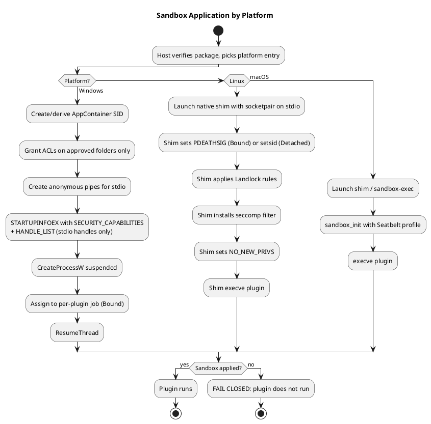

# Sandbox Design

> Part of the plugin sandbox design (§4). Index and review status: [../design.md](../design.md). Diagrams: [../diagrams/](../diagrams/).

## 4. Sandbox Design

One policy is enforced everywhere, defined as what all three platforms can do: **no network, no spawning processes, filesystem access only to granted paths** (typically the plugin folder read-only plus a per-plugin data directory). Authors declare logical capabilities, and each launcher translates them.

| | Windows | Linux | macOS |
|---|---|---|---|
| Filesystem | AppContainer (consider LPAC), ACL grants to the container SID | Landlock | Seatbelt profile |
| Network | AppContainer with no capabilities | seccomp denies `socket`/`connect`; Landlock net rules on 6.7+ | Seatbelt `deny network*` |
| Process control | Job object `ActiveProcessLimit = 1` | seccomp denies `fork`/`vfork` and `clone` without `CLONE_THREAD` | Seatbelt `deny process-fork` |
| Applied by | Host, at `CreateProcess` | Native shim, before `execve` of the plugin | Shim or `sandbox-exec`, before the plugin starts |
| Resource limits | Job object memory/CPU | cgroups v2 or rlimits | rlimits (weak) |

**Rules**
- **Fail closed:** if any sandbox step fails, the plugin does not run.
- **The sandbox is applied before the plugin's first instruction.** A plugin in an arbitrary language can't sandbox itself, and restrictions applied late can miss threads the runtime already created.
- **Inherit only the channel handles.** Windows uses `PROC_THREAD_ATTRIBUTE_HANDLE_LIST` with `bInheritHandles = true`. Unix passes only the socketpair as stdio.
- **Seccomp is a deny-list.** Runtimes (Go, Node, JVM, .NET) need a wide syscall set and create threads, so allow thread creation. Don't deny `execve` in seccomp, since the shim's own exec must succeed. Landlock's execute right, limited to the plugin and runtime folders, controls what can run.
- **Linux:** set `PR_SET_NO_NEW_PRIVS` last. It also prevents pdeathsig from being cleared by setuid binaries.
- **Runtime grants:** bundled runtimes live in the plugin folder, so they're covered. A system runtime would need extra read+execute grants.
- **Broker pattern:** extra access (a user-selected file, for example) is requested over the channel. The host checks policy and returns data or a handle. §10 and §11 extend this into declared, approved permissions for external files and network endpoints.
- **No shared named mutexes or shared memory** between host and plugin.
- **Windows specifics:** AppContainer needs Windows 8+. `Process.Start` can't set the attribute, so the launcher P/Invokes `CreateProcessW`. Grant the container SID read+execute on the plugin folder or it fails at startup. LPAC (`PROC_THREAD_ATTRIBUTE_ALL_APPLICATION_PACKAGES_POLICY`) is stricter and needs explicit grants even for system paths.
- **macOS:** `sandbox_init` is deprecated but functional. Don't promise Linux-grade isolation there.
