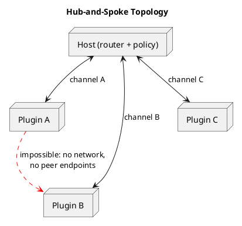
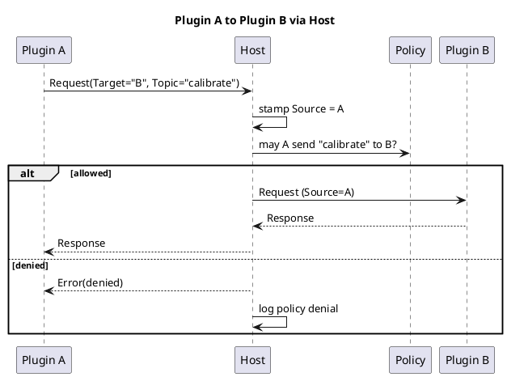

# Communication

> Part of the plugin sandbox design (§5). Index and review status: [../design.md](../design.md). Diagrams: [../diagrams/](../diagrams/).

## 5. Communication

### 5.1 Topology: hub and spoke

Every plugin has exactly one channel, and it goes to the host. Plugins never learn about each other, and the host is the only router, so policy, logging, and rate limits live in one place.



### 5.2 Structural enforcement

- **Bound plugins use stdio:** a socketpair (Unix) or anonymous pipes (Windows) wired to the child's stdin/stdout, and stderr is for logs. Every language can do this. Because the plugin needs no ability to create sockets or open named pipes, the sandbox denies them, so a plugin can't reach another plugin even if it wants to.
- **Detached plugins** can't use inherited stdio (see §6.2). They listen on a well-known endpoint (named pipe with an ACL on Windows, Unix socket in a `chmod 700` directory on Unix). On Linux this means the seccomp filter allows `socket(AF_UNIX)` only for those plugins. Authentication uses a token from a host-only file.

### 5.3 Envelope

```csharp
record Envelope(
    MessageType Type,        // Request, Response, Event, Heartbeat, Shutdown, Error, ResourceRequest, ResourceGrant
    Guid RequestId,
    Guid? CorrelationId,     // on responses
    string Topic,
    string? Target,          // logical name or capability, never a PID or pipe
    string Source,           // STAMPED BY HOST; plugin-supplied value ignored
    int TtlMs,
    int Hops,
    byte[] Payload);
```

- Frames are length-prefixed with a hard maximum (1-4 MB). Violations disconnect the plugin.
- The host stamps `Source` from the channel the frame arrived on.
- The protocol is defined in a language-neutral IDL (protobuf, or JSON-RPC with a published schema). Thin SDKs (C#, Rust, Go, Python, Node, C/C++) implement it, and any other language can follow the spec.
- Use a strict-schema serializer with **no type-name or polymorphic deserialization**.

### 5.3.1 Supported patterns

| Pattern | Flow |
|---|---|
| Host to plugin request/response | Matched by `CorrelationId` |
| Plugin to host event | Published on a topic, and the host consumes it |
| Plugin to host request | Config, or a file via the broker |
| Plugin to plugin | Sent to the host with a `Target`, and the host checks policy and forwards |
| Pub/sub | Only through the host's topic table |



### 5.4 Policy and reliability

- **Default deny.** Each plugin's manifest declares what it may publish, subscribe to, and send to, plus limits (`msgPerSec`, `maxFrameBytes`). The receiver may also refuse unsolicited senders. Log all denials.
- **Bounded per-plugin queues** (`System.Threading.Channels`) so one slow plugin can't stall the router. When a queue fills, drop, fail, or disconnect per policy.
- **Timeouts on every request** (`TtlMs`), and a hop counter stops relay storms.
- **Priority lane for control traffic** (heartbeat, shutdown), so data floods can't cause false hang detection.
- **Restarting plugin:** fail fast with "unavailable" by default. Optionally buffer bounded idempotent messages and replay by `RequestId`.
- **Treat every payload as hostile,** including plugin A's data arriving at B. Enforce size, rate, and depth limits before deserializing.
- **Large data:** chunk it over the channel or use the broker to hand over a file handle.

Policy example:

```json
{
  "id": "telemetry",
  "publish": ["device.readings"],
  "subscribe": ["config.updated"],
  "sendTo": ["analytics"],
  "limits": { "msgPerSec": 200, "maxFrameBytes": 1048576 }
}
```
