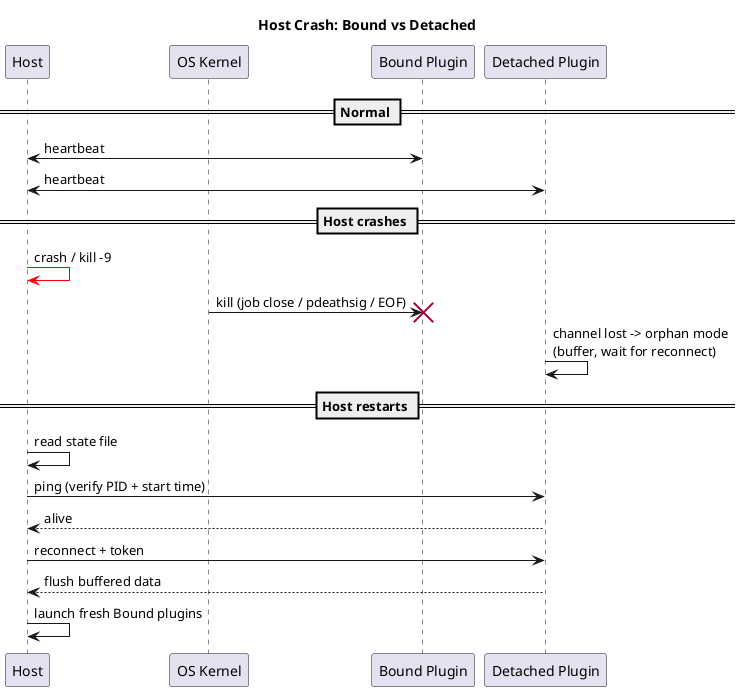
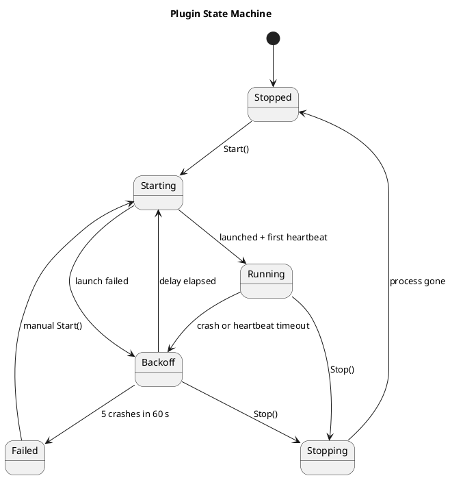
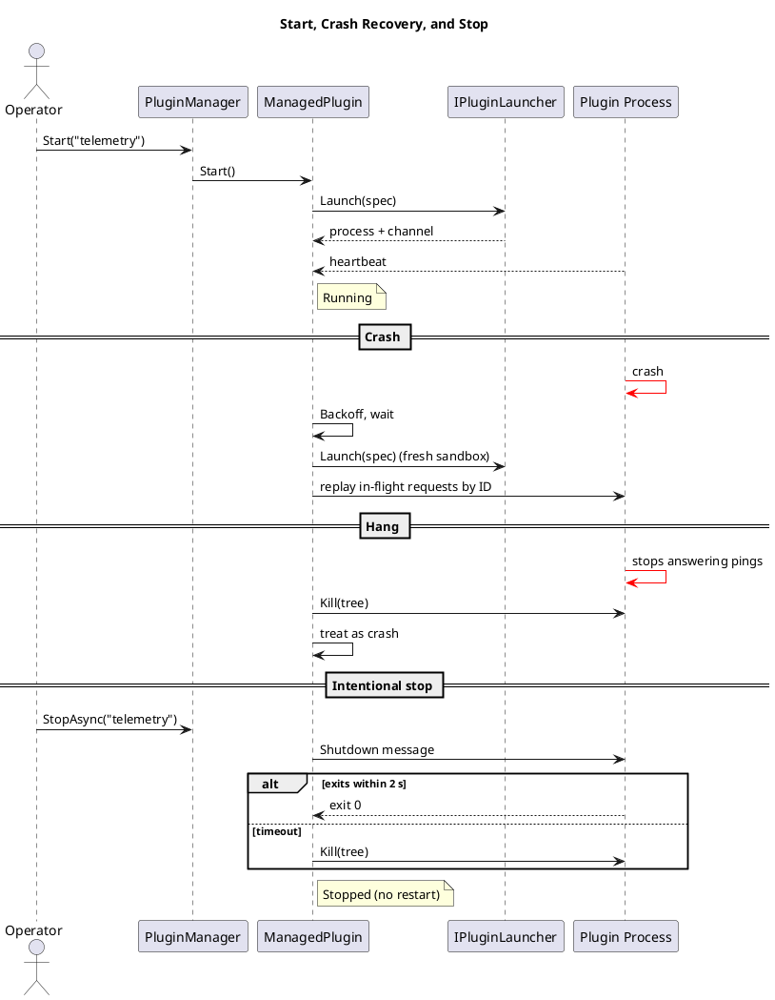

# Lifetime Binding, Lifecycle and Crash Safety

> Part of the plugin sandbox design (§6, §7, §8). Index and review status: [../design.md](../design.md). Diagrams: [../diagrams/](../diagrams/).

## 6. Lifetime Binding

### 6.1 Bound plugins

| OS | Mechanism |
|---|---|
| Windows | **One job object per plugin** with `KILL_ON_JOB_CLOSE` and `ActiveProcessLimit = 1`. Start suspended, assign, then resume. Never inherit or duplicate the job handle. |
| Linux | `PR_SET_PDEATHSIG(SIGKILL)` set in the shim, plus a `getppid()` check to close the race. Spawn from a long-lived dedicated thread, because pdeathsig fires when the spawning *thread* exits. Cgroup `cgroup.kill` is a stronger option when a supervisor is available. |
| macOS | No kernel equivalent. Use the channel-EOF watchdog plus `getppid()` polling or kqueue `NOTE_EXIT`. |

The **channel-EOF watchdog** is the portable baseline: the SDK exits when stdin reaches EOF, which the kernel guarantees when the host dies, provided nothing else holds the write end. The kernel mechanisms are hardening on top. All of them are outright kills with no cleanup, so plugins must tolerate being killed at any instant.

### 6.2 Detached plugins

- **Windows:** don't assign to a kill-on-close job, use `CREATE_BREAKAWAY_FROM_JOB` if a parent job requires it, and use `DETACHED_PROCESS`.
- **Linux/macOS:** skip pdeathsig and call `setsid()`. Under systemd, launch via `systemd-run --user --scope` or a separate unit, since a service's cgroup is killed on stop by default.
- **Reconnect:** a state file holds PID, **start time** (PID-reuse guard), and endpoint. On startup the host pings and reattaches, or relaunches if the plugin is dead.
- **Single instance:** a named mutex or `flock` prevents duplicates.
- **Orphan mode:** channel loss means "wait for reconnect", not "exit". The plugin buffers data (bounded, ideally to disk) and has a max-orphan timeout.
- **Still capped:** memory limits via job object or cgroup.
- **Explicit stop:** the host reconnects and sends a stop message, and the uninstaller must stop detached plugins.
- **Must-always-run work** such as telemetry collection is better as an OS service (Windows Service, systemd, launchd) with the host as a client.

## 7. Lifecycle Management

The model is **desired state vs. actual state**. `Start()` and `Stop()` change intent, and one supervisor loop per plugin reconciles reality. Manual control and crash recovery share one code path, so they can't conflict.

**Supervisor behavior**
- **Crash detection:** process exit, or no heartbeat for 10 s. Hung plugins are killed (`Kill(entireProcessTree: true)`) and treated as crashes.
- **Heartbeat semantics:** pings must be answered by the same loop that handles requests, so a deadlocked plugin can't keep beating from a side thread. The SDK spec requires this.
- **Backoff:** 500 ms doubling to 30 s with jitter, reset after one stable minute.
- **Crash-loop protection:** 5 crashes in 60 s moves the plugin to `Failed`, and a manual `Start()` resets it.
- **Intentional stop never restarts.** It sends a shutdown message, waits about 2 s, then kills.
- **Every restart rebuilds the sandbox,** including a fresh job object, grants, and channel.
- **`StopAsync` completes only when the process is gone,** so `RestartAsync` can't leave two copies running.
- **Dependencies:** start in dependency order and stop in reverse.
- **Host shutdown:** gracefully stop Bound plugins and leave Detached ones running. Job objects and pdeathsig remain the backstop if the host crashes first.
- **Windows detail:** keep the process handle open for exit codes, and prefer waiting on the raw handle, since `Process.GetProcessById` can fail with access denied on sandboxed processes.

## 8. Crash Safety and State

- Plugins must be **idempotent and restartable**, not reentrant. The host can kill and relaunch them at any instant.
- Plugins stream results and checkpoints to the host as they go, and the host owns committed state. After a restart the host replays in-flight requests by ID.
- Locks are not shared with plugins, which avoids the following kill behavior:

| Lock type | Result when its holder is killed |
|---|---|
| Windows named mutex | Released, marked *abandoned* |
| `flock` / `fcntl` | Released |
| SysV semaphore | Released only with `SEM_UNDO` |
| POSIX named semaphore | **Stays locked forever** |
| pthread mutex in shared memory | Stuck unless robust (`EOWNERDEAD`) |

- Every host wait on a plugin has a timeout.
