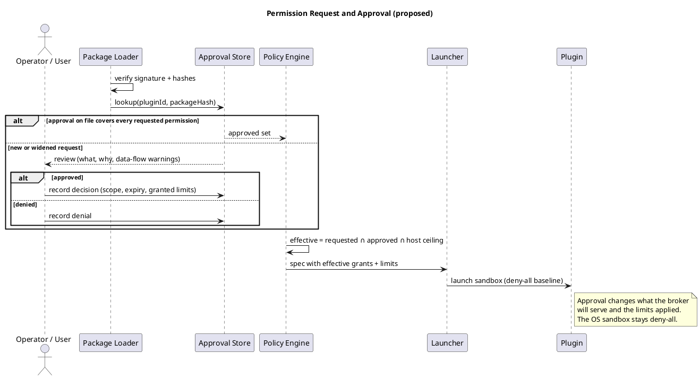

# Permissions and Approval (proposed)

> Part of the plugin sandbox design (§10). Index and review status: [../design.md](../design.md). Diagrams: [../diagrams/](../diagrams/).

## 10. Permissions and Approval (proposed)

Plugins start with the deny-all baseline from §4. A plugin that needs more, such as managing third-party data outside the host application, **declares** it in the manifest. A second party, the operator or user of the host, **approves** it. The author cannot grant themselves access.

### 10.1 Declaring permissions

Authors declare logical permissions, not raw OS rules or paths. Each has an `id` (used in broker calls and audit logs) and a plain-language `reason` shown at review.

```json
"permissions": {
  "files": [
    { "id": "exports", "scope": "external", "path": "{userDocuments}/Exports",
      "mode": "read", "delivery": "handle",
      "reason": "Read customer export files to import them" }
  ],
  "network": [
    { "id": "orders-db", "transport": "tcp", "mode": "blind",
      "host": "mongo.example.com", "port": 27017,
      "secondary": [ { "host": "mongo2.example.com", "port": 27017 } ],
      "reason": "Read and write order records in the customer's MongoDB" }
  ],
  "groups": [
    { "id": "feed", "transport": "udp-multicast", "group": "239.1.2.3", "port": 5000,
      "direction": "receive", "reason": "Receive instrument telemetry" }
  ],
  "listen": [],
  "limits": { "tunnelBytesPerSec": 5000000, "maxStreams": 4, "cpuPercent": 25, "memoryMb": 256 }
}
```

- Fields mirror §11's connection models. Anything not declared is denied.
- `{userDocuments}`-style tokens are resolved by the host, so manifests are portable and never contain machine paths.
- Wildcards (`*.mongodb.net`) are allowed only with an explicit `wildcard: true`, and the review dialog calls them out as broad.

### 10.2 Approval

An approval record is keyed by plugin id, **package hash and signer**, and permission id:

| Field | Meaning |
|---|---|
| decision | `approved`, `denied`, or `ask-each-time` |
| scope | `install`, `session`, `once`, or until `expires` |
| granted | The permission as approved, including any lower limits the approver set |
| by / at | Who approved and when |

- **Re-approval is required** when a new version requests anything not already approved, or widens a limit. A new version that requests a subset keeps its approvals.
- **Approval modes** per permission: `auto` (inside the host ceiling, low risk), `user`, `admin`, `deny`. Whether any permission should need two approvers (dual control) is open (§18).
- **Revocation** takes effect immediately for brokered access, because the broker stops serving. A permission change that needs a different OS sandbox restarts the plugin.
- **Audit:** every request, approval, revocation, use and denial is logged with plugin id, version, hash and permission id.

### 10.3 Effective policy

```
effective policy  =  requested (manifest)  ∩  approved (store)  ∩  host ceiling
```

The **host ceiling** is host-wide configuration the plugin can never exceed, regardless of approval. Examples: never reach loopback, link-local, cloud metadata addresses or private ranges; never reach paths outside named roots; maximum limits. Anything outside any one of the three sets is denied, which preserves fail-closed.

### 10.4 Review dialog

Show what is being requested, why, and **combinations that matter**. Reading external files or data plus any network path means data can leave the host, so say so plainly. Broad wildcards, inbound listeners, peer-to-peer traffic and raised limits get explicit warnings.


