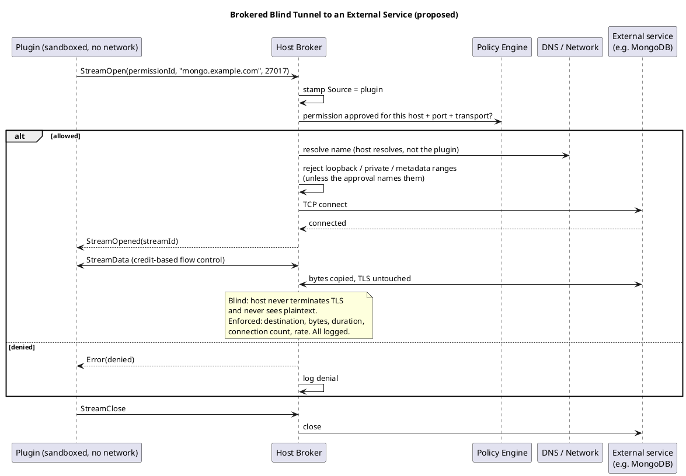

# Brokered External Access (proposed)

> Part of the plugin sandbox design (§11). Index and review status: [../design.md](../design.md). Diagrams: [../diagrams/](../diagrams/).

## 11. Brokered External Access (proposed)

Approved access to files and the network is **served by the host**, not by widening the OS sandbox. The sandbox stays at "no network, no files beyond the plugin folder and data directory". The host performs approved operations on the plugin's behalf over its single channel, which fits hub-and-spoke (§5.1).

Benefits: one policy model on all three OSes (macOS and Windows can't match Linux's fine-grained network rules); approval changes the broker, not the sandbox, so grants and revocations need no restart and per-use prompts become possible; every use is logged in one place.

### 11.1 Connection models

| Model | Examples | Host behavior | Declared as |
|---|---|---|---|
| Point to point, stream | HTTPS, SFTP, SSH, single-node DB | Open one outbound TCP connection to an approved endpoint and relay it | host, port, `tcp` |
| Point to point, datagram | DNS, NTP, syslog, UDP telemetry | Relay datagrams with rate and size caps | host, port, `udp` |
| Point to multipoint | UDP multicast, LAN broadcast, pub/sub feeds | Host joins the group on an approved interface and fans out to each approved plugin | group, port, interface, direction |
| Primary plus secondary connections | FTP, Mongo replica sets, SIP/RTP | Open the primary; secondary endpoints must be **declared** (blind mode) or **derived** by a protocol helper | primary plus `secondary` list or a `helper` |
| Inbound | A plugin that serves a webhook | **Host** owns the listening socket and passes accepted connections to the plugin | port, bind interface, allowed source ranges, max connections |
| Peer to peer | BitTorrent, WebRTC, custom mesh | Destinations unknown at approval time, so limit by class only | port range, quotas; no per-peer allowlist; deny by default |

### 11.2 Blind tunnels (default)

A blind tunnel is a `CONNECT`-style relay: the plugin names a host and port, the host checks it against the approved policy, then copies bytes in both directions. The host does **not** terminate TLS and never sees plaintext.

- **Works for any protocol** (Mongo over TLS, SFTP, SMTP, custom binary), with no parser per protocol.
- **Credentials and certificate checks stay in the plugin.** The host never holds them.
- **The plugin sends a hostname, and the host resolves it.** The host then rejects loopback, private, link-local and metadata ranges unless the approval names them, which blocks SSRF and DNS rebinding.
- **Enforced without reading content:** destination, transport, concurrent streams, new streams per second, bytes per direction, duration. Logged: destination, start/end, bytes.
- **Not enforceable:** operations (read versus delete), data loss prevention, or whether the plugin verified certificates. **Approving a blind tunnel means trusting the plugin with everything that endpoint accepts.** The review dialog must say so.
- **No derived secondary connections.** Protocols that negotiate extra connections inside the stream (FTP passive data ports, FTPS) cannot be handled blind. Either list every host and port in `secondary`, or use an application-level helper (§11.4), or require a better protocol (use SFTP, not FTP).
- **Wildcards are broad.** `*.mongodb.net:27017` makes everything under that domain reachable. On shared CDN or cloud addresses, a host-level approval is only as narrow as the address.

### 11.3 Broker operations on the channel

New message types alongside the envelope's existing `ResourceRequest` and `ResourceGrant`:

| Operation | Purpose |
|---|---|
| `StreamOpen(permissionId, host, port)` / `StreamOpened` / `StreamClose` | Outbound relay |
| `StreamData` | Bulk data. Uses a small stream frame (stream id, flags, length) with **credit-based flow control** so queues stay bounded, rather than a full envelope per chunk |
| `DatagramSend` / `DatagramReceived` | UDP and multicast |
| `GroupJoin` / `GroupLeave` | Multicast membership |
| `Listen` / `Accepted` | Host-owned listener, accepted connections handed to the plugin as streams |
| `Dns.Lookup(name, type)` | Host-resolved name lookup, checked against the approved list. Covers SRV/TXT for `mongodb+srv://` |
| `File.Open(permissionId, relativePath)` | Returns a read-only (or approved mode) **handle** or stream. See §11.5 |

Every call is checked against the effective policy (§10.3) and logged.

### 11.4 Optional protocol-aware modes

Blind tunnels are the baseline. Two opt-in extensions exist for cases that need more enforcement. Neither is required for v1.

- **Semantic broker.** The plugin calls a host API (`data.find(collection, filter, options)`) and the host runs it with its own driver. Credentials never reach the plugin, policy is structured (database, collection, read-only), and results can be size-capped. Cost: a narrower API than the full driver, and the abstraction must be maintained. Best for a few well-known backends.
- **Protocol helper** (for example an FTP gateway). Parses the control stream so passive-mode data connections can be opened for exactly that session, to the same host, and closed with it. Active mode (server connects back) is refused. Cannot work when the control channel is encrypted (FTPS) unless the host terminates TLS, which defeats blind mode.
- A wire-protocol-aware proxy (parsing Mongo OP_MSG to allow only some commands) is possible but fragile and parser bugs become security bugs. Treat it as a later option.

### 11.5 Brokered files

- The host opens the approved path and hands the plugin a **handle** (`DuplicateHandle` on Windows, fd passing over a Unix socket on Linux and macOS) or streams the content. The plugin needs no filesystem rights beyond its own folders.
- The host resolves and checks paths itself, which avoids symlink and traversal races, and can pass read-only handles.
- Limits: plugins that need real paths (native libraries, tools that shell out) won't work through handles. Very large data should use handles or streaming rather than being copied in messages.

### 11.6 How a plugin reaches the broker

A sandboxed plugin has no sockets. The primary route is an **SDK stream API** over the existing channel (`OpenStream(...)` returning a stream the language's networking library can wrap). Many database drivers do not accept a custom transport. For those, an option is a local SOCKS5 or `CONNECT` endpoint on a Unix socket or named pipe that the sandbox permits for that purpose only. This relaxes the structural rule that plugins cannot create sockets, so it needs a deliberate decision (§18, open question).

### 11.7 Detached plugins

A Detached plugin keeps running when the host dies, but brokered access dies with the host. A Detached plugin that needs external network access therefore cannot rely on the broker while the host is down. Options: buffer in orphan mode until the host returns (§6.2), or run it as an OS service with its own tightly scoped direct network access. This is a real design gap (§18).
