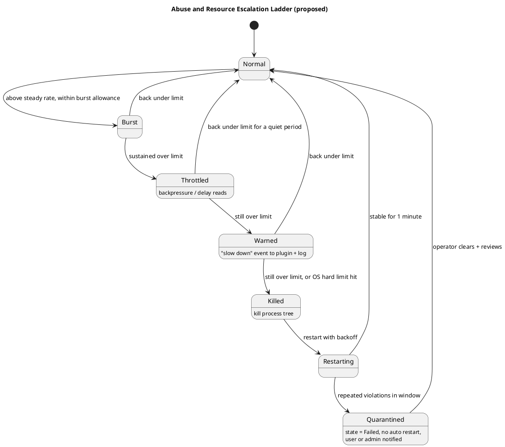

# Resource Limits and Abuse Handling (proposed)

> Part of the plugin sandbox design (§13). Index and review status: [../design.md](../design.md). Diagrams: [../diagrams/](../diagrams/).

## 13. Resource Limits and Abuse Handling (proposed)

Two layers, because host-side detection is reactive and polling-based.

### 13.1 Hard limits (OS-enforced)

These hold even if the plugin hangs, spins or ignores the host. The existing per-plugin job object (`PluginJob.cs`) is the Windows starting point.

| Resource | Windows (job object) | Linux (cgroup v2) | macOS |
|---|---|---|---|
| CPU | CPU rate control, hard cap | `cpu.max` | Weak: `setrlimit`, monitoring |
| Memory | Job memory limit | `memory.max` | `setrlimit`, monitoring |
| Processes / threads | Active process limit | `pids.max` | `RLIMIT_NPROC` |
| Disk I/O | Limited, rely on monitoring | `io.max` | Monitoring only |
| Disk space | Quota on the data directory | Quota or size-limited mount | Quota or monitoring |

### 13.2 Soft limits (host-enforced)

Each plugin is serviced by its own loop with bounded queues, so one flooding plugin cannot stall the router or other plugins.

- **Channel:** token buckets for messages and bytes per second, `maxFrameBytes`, bounded queues. Backpressure first; never buffer without bound. Control traffic (heartbeat, shutdown) keeps its priority lane (§5.4).
- **Tunnels:** `maxStreams`, new streams per second, bytes per direction, duration. These also protect the **external service** from a plugin that floods it.
- **Brokered files:** open handles, throughput, size.
- **Liveness:** a plugin burning CPU misses its heartbeat (§7), so hangs and spins are caught as a side effect.

### 13.3 Escalation ladder

1. **Allow short bursts:** token buckets with a burst size, and a sustained window before acting.
2. **Throttle:** delay or slow reads so the plugin feels backpressure.
3. **Warn:** send a "slow down" event and log it.
4. **Kill and restart:** kill the process tree, then restart with the §7 backoff.
5. **Quarantine:** repeated violations in a window move the plugin to `Failed` (no automatic restart) and notify the operator, who clears it after review.

### 13.4 Declared and approved limits

The manifest may request higher limits (a high-volume telemetry plugin, for example). Effective limits follow the same intersection as other permissions (§10.3), and unusually high requests are flagged at review. Log throttle events as well as kills, so throttling does not hide a real problem.

### 13.5 Caveats

- A fork bomb, memory spike or disk fill needs the OS limits to stop quickly; the host only observes and reports.
- Account usage per plugin so a limit hit is attributed correctly.
- "Looks like a DoS" is a heuristic. Fixed limits plus a quarantine rule are more predictable than anomaly detection, so start there.
