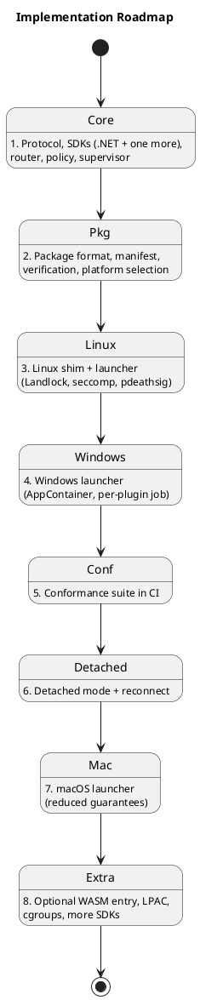

# Conformance, Security Checklist, Testing and Build Order

> Part of the plugin sandbox design (§14, §15, §16, §17). Index and review status: [../design.md](../design.md). Diagrams: [../diagrams/](../diagrams/).

## 14. Conformance Suite

The conformance suite is the real portability guarantee, since artifacts differ per platform. It is language-neutral: a set of test plugins and a runner that exercise the protocol and escape attempts.
- Network connections, spawning, and access to ungranted files are denied.
- *(Proposed)* Brokered access works only for approved permissions: an unapproved host, port, transport, path or mode is denied; a revoked permission stops being served; private, loopback and metadata destinations are refused after DNS resolution.
- *(Proposed)* Resource limits hold: a CPU spinner, memory hog, fork bomb and stream flooder are each throttled or killed, and other plugins keep running.
- Denials surface as consistent errors across OSes.
- Heartbeat is answered by the main loop, shutdown is honored, and message round-trips work.
- Every SDK must pass it on every OS it claims, and results gate the manifest's `platforms` list.

## 15. Security Checklist

- [ ] Verify signature and per-file hashes before extraction
- [ ] Run only from host-owned, read-only locations
- [ ] Least-privilege grants, and remove ACLs on uninstall (they persist on disk)
- [ ] Inherit only channel handles, and share no named objects
- [ ] Fail closed on any sandbox error
- [ ] Host stamps `Source`, and validates and rate-limits every frame
- [ ] Strict-schema serialization with no type-name deserialization
- [ ] Log launches, crashes, denials, and policy violations
- [ ] *(Proposed)* Approvals keyed to package hash and signer; widened requests require re-approval
- [ ] *(Proposed)* Effective policy is the intersection of requested, approved and host ceiling
- [ ] *(Proposed)* Host resolves DNS and rejects loopback, private, link-local and metadata ranges unless named in the approval
- [ ] *(Proposed)* Review dialog warns about data-flow combinations, wildcards, listeners and peer-to-peer
- [ ] *(Proposed)* Bounded queues, credit-based flow control and per-plugin limits on every brokered stream
- [ ] *(Proposed)* Hard OS limits (job object, cgroup) set on every launch, not only soft limits

## 16. Testing

| Test | Expected |
|---|---|
| `kill -9` or Task Manager on host | Bound children die, Detached survive |
| Plugin attempts network, spawn, or unauthorized file access | Denied on every OS |
| Plugin deadlocks its main loop | Heartbeat timeout, kill, restart |
| Plugin crash-loops | Reaches `Failed` after 5 in 60 s |
| `Stop` during `Backoff` | No restart |
| Plugin A tries to reach B directly | Impossible. Via host without permission: denied and logged |
| Host inside a parent job (Windows) | Bound and Detached semantics still hold |
| Host in a container or PID namespace | `getppid()` check behaves correctly |
| Detached plugin dead at host restart | Relaunched with no duplicate |
| Missing platform entry | Clear "unavailable" message |
| Go, Node, and JVM plugins under seccomp | Thread creation works |
| *(Proposed)* Unapproved tunnel host, port or transport | `StreamOpen` denied and logged |
| *(Proposed)* Approved hostname that resolves to a private or metadata address | Refused after resolution |
| *(Proposed)* Plugin ships a new version requesting an extra permission | Re-approval required; old version's approvals unchanged |
| *(Proposed)* Permission revoked while a stream is open | Stream closed, further opens denied, no restart needed |
| *(Proposed)* Plugin floods a tunnel or the channel | Backpressure, then warning, then kill; other plugins unaffected |
| *(Proposed)* CPU spinner / memory hog / fork bomb | Stopped by the OS hard limit |
| *(Proposed)* Repeated violations | Plugin quarantined (`Failed`), operator notified |
| *(Proposed)* Two plugins both want local port N | No conflict: neither opens host ports |
| *(Proposed)* Host dies while Detached plugin has brokered access | Access stops; plugin enters orphan mode (see §11.7) |

## 17. Build Order

*(Proposed)* Suggested placement of the new work: resource limits (§13.1) belong with steps 3 and 4, since the launchers should set job objects and cgroups from the start. The permission manifest and approval store (§10) belong with step 2. The broker (§11) comes after the conformance suite exists (step 5), because its deny cases are the tests that matter. Network namespaces (§12) go with the Linux launcher, and the optional Windows firewall layer with step 8.
