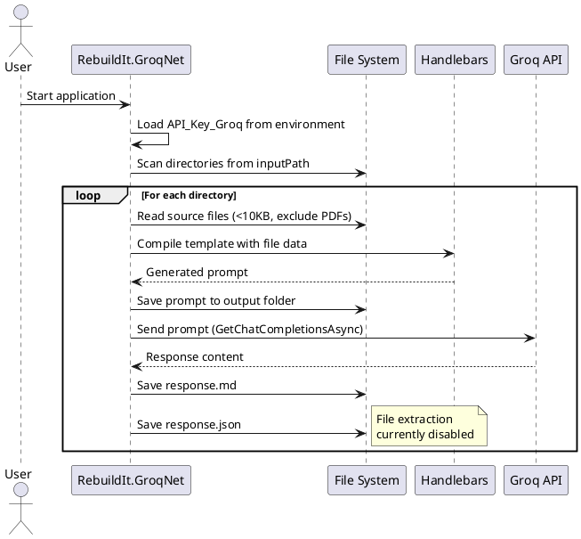

# RebuildIt.GroqNet

AI-assisted code documentation tool that processes source code directories using Groq's cloud-based LLM API.

## Description

This tool scans directories of source code, reads files, generates prompts using Handlebars templates, and sends them to Groq's API for processing. It's configured to generate documentation but can be adapted for other code transformations.

## Current Configuration

- **Input Path**: `C:\Repos\Application\Net.Libs\docs`
- **Output Path**: `.\Net.Core\src`
- **Template**: `GenerateDocumentationForThisCode.md.hbs`
- **LLM Backend**: Groq Cloud API
- **Model**: LLaMA3-8b

## Requirements

- Groq API key must be set in environment variable: `API_Key_Groq` (User scope)

## Status

The file extraction logic (lines 83-89 in Program.cs) is currently commented out, so the tool only generates and saves LLM responses without automatically creating output files.

## Process Flow

## Dependencies

- HandlebarsDotNet (template engine)
- GroqNet (Groq API client)

## Usage

1. Set environment variable `API_Key_Groq` with your Groq API key
2. Configure the input/output paths and template in `Program.cs`
3. Run the application
