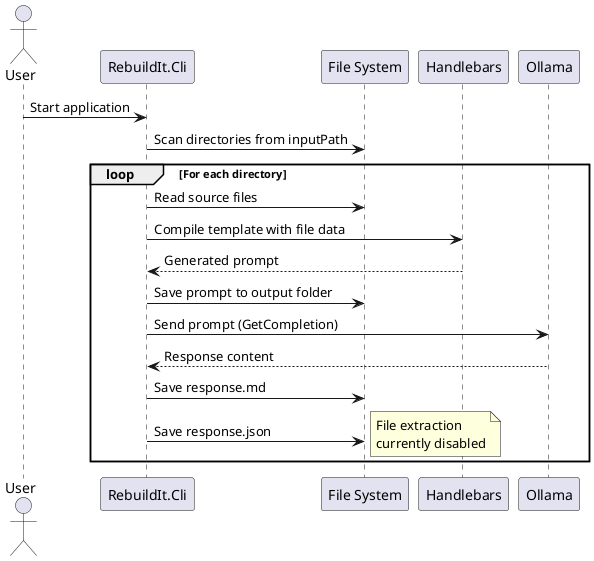

# RebuildIt.Cli

AI-assisted code generation tool that processes source code directories using a local LLM via Ollama.

## Description

This tool scans directories of source code, reads files, generates prompts using Handlebars templates, and sends them to a local Ollama instance for processing. It's configured to generate unit tests but can be adapted for other code transformations.

## Current Configuration

- **Input Path**: `C:\Repos\Application\Net.Api`
- **Output Path**: `.\Net.Api\tests`
- **Template**: `GenerateUnitTests.md.hbs`
- **LLM Backend**: Ollama (http://192.168.1.170:11434)
- **Model**: llama3:instruct

## Status

The file extraction logic (lines 72-78 in Program.cs) is currently commented out, so the tool only generates and saves LLM responses without automatically creating output files.

## Process Flow

## Dependencies

- HandlebarsDotNet (template engine)
- OllamaSharp (local LLM client)

## Usage

1. Configure the input/output paths and template in `Program.cs`
2. Ensure Ollama is running at the configured endpoint
3. Run the application
